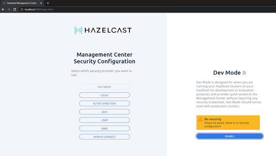
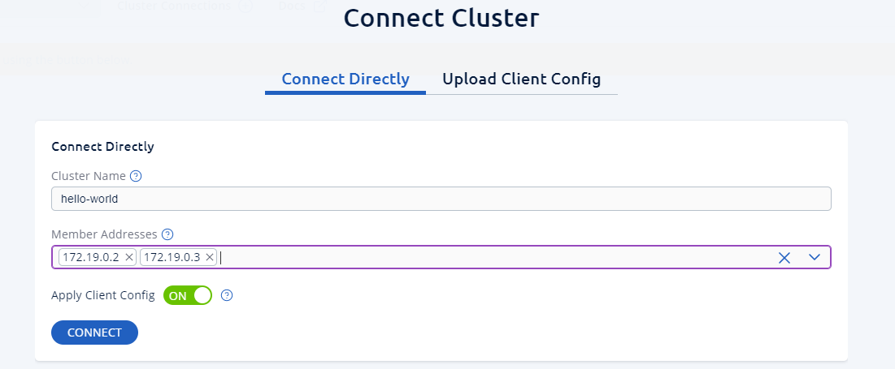
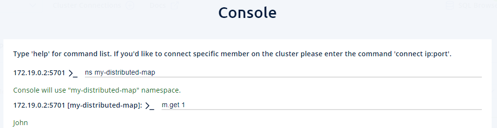

## Create a new Docker network with name hazelcast-network:
`docker network create hazelcast-network`

## Use the docker command twice to start two instances of Hazelcast:

`docker run -it --network hazelcast-network --rm -e HZ_CLUSTERNAME=hello-world -p 5701:5701 hazelcast/hazelcast:5.1-SNAPSHOT`

`docker run -it --network hazelcast-network --rm -e HZ_CLUSTERNAME=hello-world -p 5702:5702 hazelcast/hazelcast:5.1-SNAPSHOT`

## Run the existing code from HazelcastMapSample class from sources

## Use the docker command to start a Management Center of Hazelcast:

`docker run --network hazelcast-network -p 8080:8080 hazelcast/management-center:latest-snapshot`

## Open a browser window:

`http://localhost:8080`.

## Enable Dev mode:
Click enable:

## Enter cluster-name [hello-world] and member ip-addresses:

## Try to view cluster

## Go to Storage and Click Console
### Enter first command
`ns my-distributed-map`
### Enter second command
`m.get 1` -> `John`
